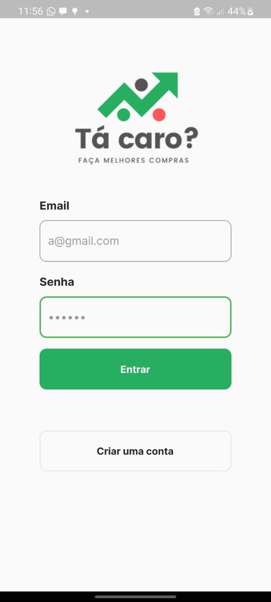
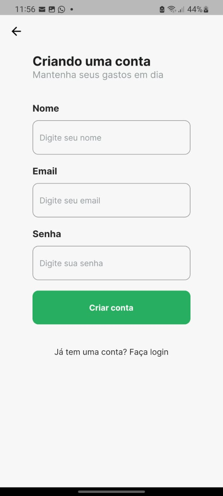
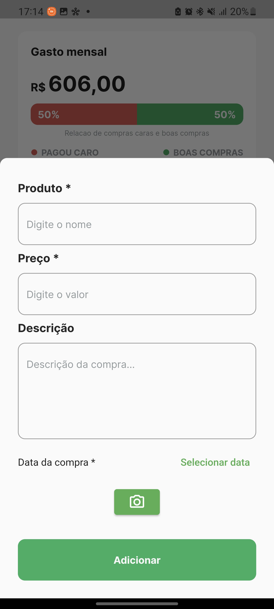
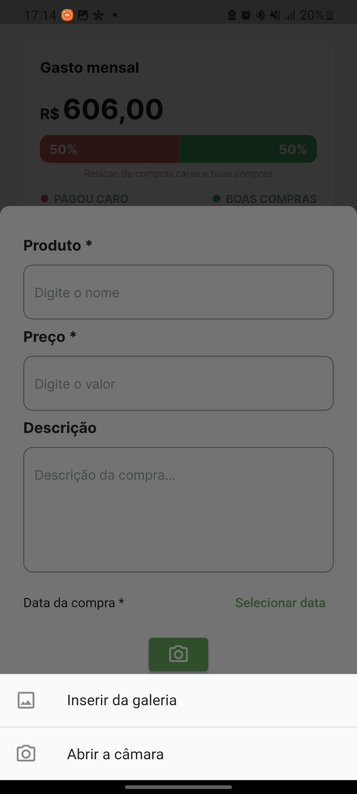
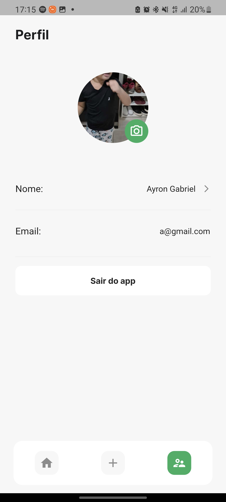
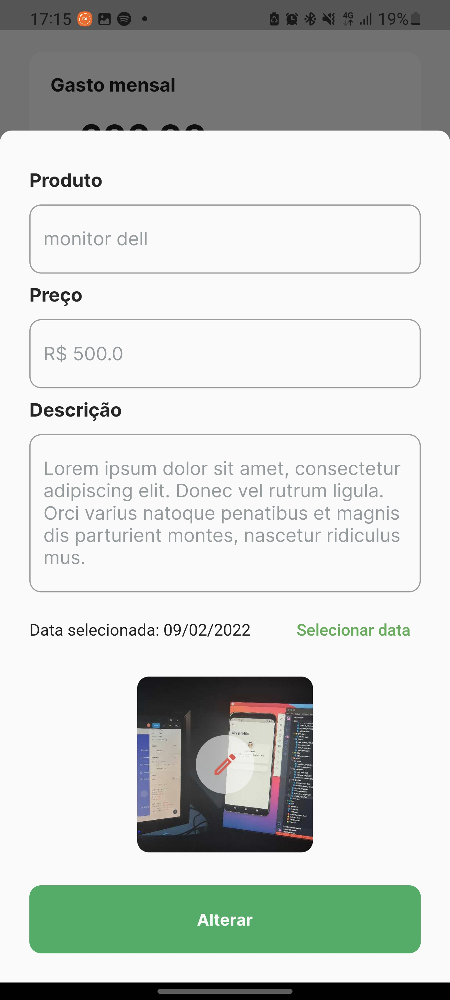
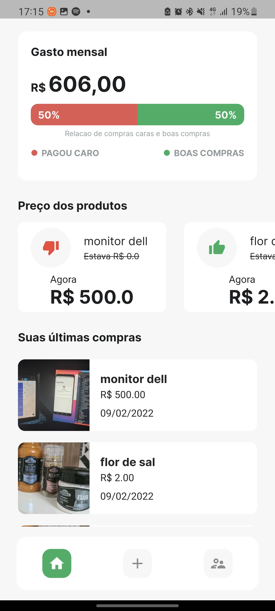
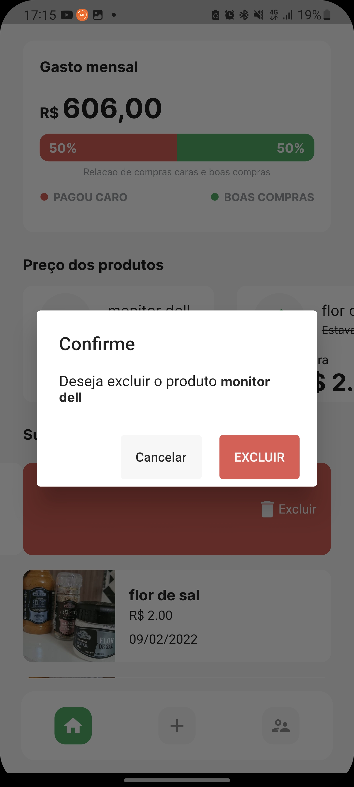
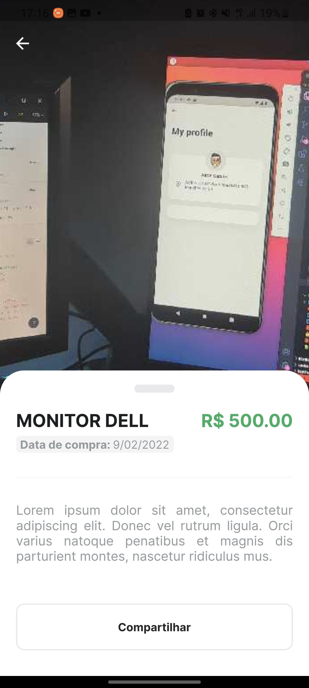
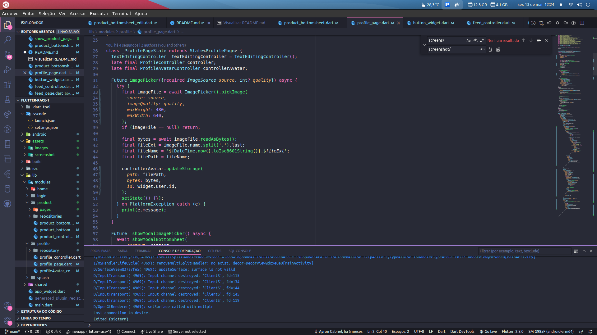

<!--
repo name: meals
description: Aplicativo de Cardápio de receitas, construído durante o estudo do módulo de Navegação & Múltiplas Telas - Flutter
github name:  ayrongabriel
link: https://github.com/ayrongabriel/meals
logo path: assets/images/logo.png
screenshot: assets/screenshot/screen.gif
email: ayrongabriel@gmail.com
-->

<br />
<p align="center">
    <a href="LINK">
        
    </a>
    <h3 align="center">FLUTTER RACE - GABUL DEV</h3>
</p>
<br><br>


## Tabela de Conteúdo

- [Tabela de Conteúdo](#tabela-de-conteúdo)
- [Sobre](#sobre)
    - [Alterações](#alterações)
- [Fontes](#fontes)
- [Color](#color)
- [Packages](#packages)
- [Figma](#figma)
- [Screenshots](#screenshots)
- [Gif](#gif)
- [License](#license)


<br>

## Sobre

Desenvolver um aplicativo com login e cadastro utilizando ([Supabase](https://app.supabase.io/)) alternativa de código aberto ao Firebase. 
Após logado no app o usuário poderá inserir suas compras diárias e acompanhar se está pagando a mais pelo mesmo produto. 

Na homepage mostra todas as compras e um chart com uma análise percentual sobre as compras mais cara para o barato, em que atribui-se bom para um percentual maior de preço baixo e ruim para uma quantidade maior do mais caro.

<br>

#### Alterações

- Add imagem ao produto via câmara ou galeria
- Uso do storage para salvar as imagens de perfil, thumbnails do produto
- Add dataPicker para seleção da data
- Add Dismissible para edição para a direita e para esquerda alert com mensagem de confirmação e exlução da compra
- Add RUD para completar o CRUD(Create, Read, Update, Delete)
- Tela de visualização do produto
- Tela de perfil, com edição de campo nome e alteração de imagem de perfil
- Animação básica usando animate_do
- Tela de Splash simulando carregamento com ```Future.delayed```
- Animando de transição nos thumbnails com Widget Hero
- AddiIcone e nome no Launcher

<hr>

## Fontes
- [Inter](https://fonts.google.com/specimen/Inter)

<hr>

## Color
```dart
static const primary = Color(0xFF27AE60);
static const background = Color(0xFFF7F7F7);
static const border = Color(0xFFE9E9EC);
```
<hr>

## Packages
- [google_fonts](https://pub.dev/packages/google_fonts)
- [share_plus](https://pub.dev/packages/share_plus)
- [image_picker](https://pub.dev/packages/image_picker)
- [animate_do](https://pub.dev/packages/animate_do)
- [intl](https://pub.dev/packages/intl)
- [supabase](https://pub.dev/packages/supabase)
- [flutter_launcher_icons](https://pub.dev/packages/flutter_launcher_icons)

<hr>

## Figma
[Tá caro?](https://www.figma.com/file/M60t8ulOCV7TCEYuLyrlA3/)

<hr>

## Screenshots

           
<hr>

## Gif
<p align="center">

</p>

<hr>

## License

Distributed under the MIT License. See `LICENSE` for more information.